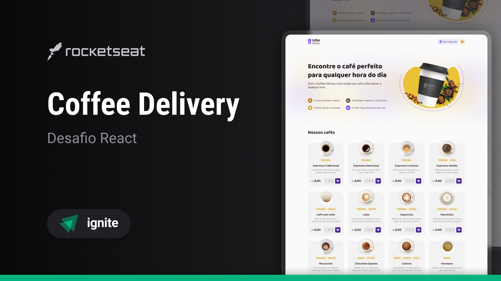

# Coffee Delivery

Coffee Delivery is a simple e-commerce website that allows users to browse and purchase coffee products. The website has a clean and modern design, with a focus on user experience and ease of use.

## 🔨 Features

- [x] Add item to cart
- [x] Increase quantity
- [x] Remove item from cart
- [x] Add address
- [x] Add payment method

## 🧪 Tools

- [React](https://react.dev/)
- [Vite](https://vitejs.dev/)
- [TypeScript](https://www.typescriptlang.org/)
- [Styled Components](https://styled-components.com/)
- [React Hook Form](https://react-hook-form.com/)
- [React Router Dom](https://www.npmjs.com/package/react-router-dom)
- [zod](https://zod.dev/)
- [immer](https://immerjs.github.io/immer/)
- [phosphor-react](https://phosphoricons.com/)

## 🚀 Deploy

You can access the project through [this link](https://coffee-delivery-palomarodrigs-projects.vercel.app/)

---

Developed with 💜 by <a href="https://www.linkedin.com/in/palomarodrigs" target="_blank">Paloma Rodrigues</a>

